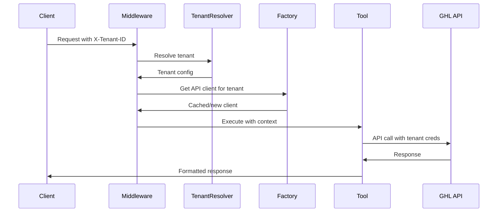

# GoHighLevel MCP Server - Multi-Tenant Architecture

## Overview

The GoHighLevel MCP Server now supports multi-tenancy, allowing a single server instance to handle multiple GoHighLevel accounts securely and efficiently. This architecture is designed for:

- **SaaS Providers**: Serve multiple clients from one deployment
- **Agencies**: Manage multiple sub-accounts
- **Enterprise**: Centralized API management across departments
- **Developers**: Test multiple configurations easily

## Architecture Components

### 1. Storage Layer (`src/storage/tenant-store.ts`)
- **InMemoryTenantStore**: Development and testing
- **EnvVarTenantStore**: Backward compatibility with single-tenant mode
- **CompositeTenantStore**: Combines multiple stores with fallback

### 2. Core Components
- **TenantResolver** (`src/core/tenant-resolver.ts`): Identifies tenants from requests
- **RequestContext** (`src/core/request-context.ts`): Carries tenant info through request lifecycle
- **GHLApiClientFactory** (`src/core/api-client-factory.ts`): Manages tenant-specific API clients
- **TenantConfigManager** (`src/core/tenant-config-manager.ts`): CRUD operations for tenant configs

### 3. Middleware (`src/middleware/tenant-middleware.ts`)
- **Tenant Resolution**: Extracts tenant ID from requests
- **Rate Limiting**: Per-tenant request limits
- **Isolation**: Ensures data access is scoped to tenant
- **Admin Auth**: Protects tenant management endpoints

### 4. Base Tool Class (`src/tools/base-tool.ts`)
- Provides multi-tenant support for all tools
- Automatic client selection based on context
- Tenant-aware logging and error handling

## Request Flow



## Configuration

### Environment Variables

```env
# Multi-tenant specific
ADMIN_API_KEY=secure-admin-key          # For tenant management
TENANT_ENCRYPTION_KEY=encryption-key    # For encrypting API keys
GHL_TENANT_ID=custom-default-id        # Optional custom default tenant

# Legacy single-tenant (still supported)
GHL_API_KEY=your-api-key
GHL_LOCATION_ID=your-location-id
GHL_BASE_URL=https://services.leadconnectorhq.com
```

### Tenant Configuration Structure

```typescript
interface TenantConfig {
  tenantId: string;        // Unique identifier
  name: string;            // Display name
  apiKey: string;          // GHL API key (encrypted)
  locationId: string;      // GHL location/sub-account ID
  baseUrl?: string;        // Optional custom API URL
  version?: string;        // API version
  settings?: Record<string, any>;  // Custom settings
  isActive: boolean;       // Enable/disable tenant
  createdAt: Date;
  updatedAt: Date;
}
```

## Usage Examples

### 1. HTTP Request with Tenant

```javascript
// Using header (recommended)
fetch('https://api.example.com/sse', {
  headers: {
    'X-Tenant-ID': 'tenant_123',
    'Content-Type': 'application/json'
  }
});

// Using query parameter
fetch('https://api.example.com/sse?tenant=tenant_123');

// Using URL path
fetch('https://api.example.com/tenant/tenant_123/sse');
```

### 2. Admin API - Create Tenant

```bash
curl -X POST https://api.example.com/admin/tenants \
  -H "Authorization: Bearer ${ADMIN_API_KEY}" \
  -H "Content-Type: application/json" \
  -d '{
    "name": "Acme Corp",
    "apiKey": "ghl_api_key_acme",
    "locationId": "loc_acme_123",
    "settings": {
      "timezone": "America/New_York",
      "features": ["sms", "email"]
    }
  }'
```

### 3. Using Tools with Multi-Tenancy

```typescript
// Tools automatically use the correct tenant
const result = await server.executeTool('search_contacts', {
  query: 'john@example.com'
});
// This searches only in the tenant's data
```

## Security Features

### 1. API Key Encryption
- All API keys are encrypted using AES-256-GCM
- Encryption key from `TENANT_ENCRYPTION_KEY` env var
- Keys are never logged or exposed in responses

### 2. Tenant Isolation
- Each request is scoped to a single tenant
- No cross-tenant data access possible
- Audit logging includes tenant context

### 3. Rate Limiting
- Default: 100 requests/minute per tenant
- Configurable per tenant if needed
- Headers indicate limit status

### 4. Admin API Protection
- Requires `ADMIN_API_KEY` for all admin operations
- Separate from tenant API keys
- Should be rotated regularly

## Performance Optimizations

### 1. Connection Pooling
- API clients cached per tenant
- Default TTL: 60 minutes
- Max cache size: 100 tenants
- LRU eviction policy

### 2. Async Context
- Uses Node.js AsyncLocalStorage
- Zero overhead for context propagation
- No thread-local storage issues

### 3. Efficient Lookups
- In-memory tenant store for fast access
- Indexed by tenant ID
- No database queries in hot path

## Monitoring and Debugging

### 1. Tenant-Aware Logging
```
[req_123_456] [Tenant: acme] Executing tool: search_contacts
[req_123_456] [Tenant: acme] Found 5 contacts
```

### 2. Request Headers
Response includes:
- `X-Tenant-ID`: Current tenant
- `X-Request-ID`: Request tracking
- `X-RateLimit-*`: Rate limit info

### 3. Health Check
```bash
curl https://api.example.com/health

{
  "status": "healthy",
  "mode": "multi-tenant",
  "server": "ghl-mcp-server",
  "version": "1.0.0",
  "timestamp": "2024-01-01T00:00:00Z"
}
```

## Migration Path

### From Single-Tenant
1. Keep existing env vars for backward compatibility
2. Default tenant uses env var configuration
3. Add new tenants via Admin API
4. Gradually migrate clients to use tenant IDs

### To Production
1. Use external store (Redis/PostgreSQL) for tenant data
2. Implement webhook notifications for tenant events
3. Add metrics collection per tenant
4. Set up monitoring and alerting

## Troubleshooting

### Common Issues

1. **"No tenant identified"**
   - Check X-Tenant-ID header is sent
   - Verify tenant exists and is active
   - Ensure middleware is properly configured

2. **"Rate limit exceeded"**
   - Check Retry-After header
   - Consider increasing limits for tenant
   - Implement client-side rate limiting

3. **"Invalid tenant configuration"**
   - Verify API key is correct
   - Check location ID matches GHL account
   - Test connection via admin API

### Debug Mode

Enable debug logging:
```env
NODE_ENV=development
DEBUG=ghl:*
```

## Future Enhancements

1. **Database Storage**: PostgreSQL/MySQL adapter for tenant store
2. **Redis Cache**: Distributed caching for multi-server deployments  
3. **Webhook Support**: Tenant provisioning via webhooks
4. **Usage Analytics**: Per-tenant usage tracking and billing
5. **Dynamic Features**: Enable/disable tools per tenant
6. **Custom Middleware**: Tenant-specific request processing
7. **Audit Logging**: Compliance-ready audit trail

## Contributing

When adding new features:
1. Extend `BaseTool` for automatic multi-tenant support
2. Use `RequestContext` for tenant-aware operations
3. Add tenant isolation tests
4. Update migration guide if needed

## License

Same as main project - see LICENSE file.